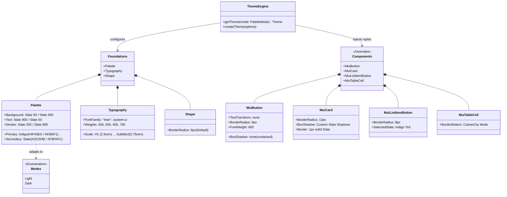
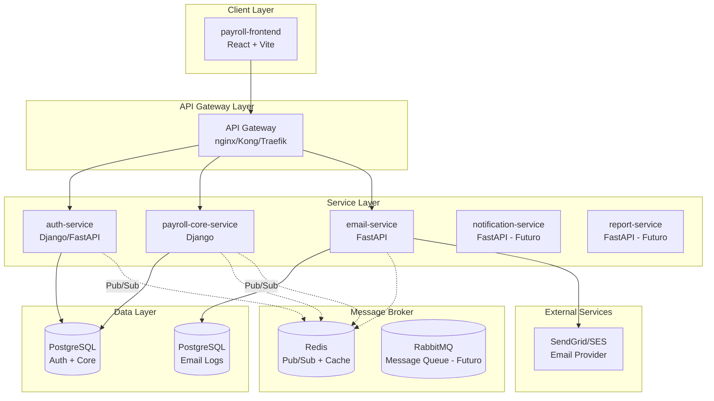

# Documentação Escopo do Projeto Payroll

## Arquivo: API_DOCUMENTATION.md

# API Documentation - Swagger/OpenAPI

## Acessando a Documentação

O sistema possui documentação interativa completa da API com **todas as fórmulas de cálculo** documentadas:

### Swagger UI (Recomendado)

Interface interativa para testar todos os endpoints:

```
http://localhost:8000/docs/
```

### ReDoc

Documentação alternativa (visual limpo):

```
http://localhost:8000/redoc/
```

### OpenAPI Schema (JSON/YAML)

Schema bruto para importar em Postman/Insomnia:

```
http://localhost:8000/schema/
```

---

## Fórmulas Documentadas

Todas as fórmulas de cálculo estão documentadas no Swagger:

### ✅ Valor da Hora

```
valor_hora = valor_contrato_mensal ÷ 220
```

### ✅ Adiantamento Quinzenal (padrão 40%)

```
adiantamento = valor_contrato_mensal × 0.40
```

### ✅ Horas Extras 50%

```
valor_hora_extra = valor_hora × 1.5
total_horas_extras = horas_extras × valor_hora_extra
```

### ✅ Horas em Feriado (100%)

```
valor_hora_feriado = valor_hora × 2.0
total_feriados = horas_feriado × valor_hora_feriado
```

### ✅ DSR (16.67%)

```
dsr = total_horas_extras × 0.1667
```

### ✅ Adicional Noturno (20%)

```
adicional_noturno = horas_noturnas × (valor_hora × 0.20)
```

### ✅ Descontos

```
desconto_atraso = (minutos ÷ 60) × valor_hora
desconto_falta = horas × valor_hora
dsr_sobre_faltas = desconto_falta × 0.1667
```

### ✅ Valor Final

```
proventos = saldo_base + horas_extras + feriados + dsr + adicional_noturno
descontos = atrasos + faltas + dsr_sobre_faltas + vt + manuais
líquido = proventos - descontos
```

---

## Exemplos de Request/Response

Todos os endpoints possuem exemplos práticos documentados no Swagger UI.

### Exemplo: Criar Folha de Pagamento

**POST** `/payrolls/calculate/`

```json
{
  "provider_id": 1,
  "reference_month": "01/2026",
  "overtime_hours_50": 10,
  "holiday_hours": 8,
  "night_hours": 20,
  "late_minutes": 30,
  "absence_hours": 8,
  "manual_discounts": 0,
  "notes": "Folha de janeiro"
}
```

**Response 201 Created:**

```json
{
  "id": 1,
  "provider_name": "João Silva",
  "reference_month": "01/2026",
  "base_value": "2200.00",
  "hourly_rate": "10.00",
  "advance_value": "880.00",
  "overtime_amount": "150.00",
  "holiday_amount": "160.00",
  "dsr_amount": "25.00",
  "night_shift_amount": "40.00",
  "total_earnings": "1695.00",
  "late_discount": "5.00",
  "absence_discount": "80.00",
  "dsr_on_absences": "13.33",
  "vt_discount": "202.40",
  "total_discounts": "300.73",
  "net_value": "1394.27",
  "status": "DRAFT"
}
```

---

## Como Usar

1. **Inicie o servidor Django:**

   ```bash
   cd backend
   source venv/bin/activate
   python manage.py runserver
   ```

2. **Acesse o Swagger UI:**

   ```
   http://localhost:8000/docs/
   ```

3. **Teste os endpoints:**
   - Cada endpoint possui um botão "Try it out"
   - Preencha os parâmetros
   - Clique em "Execute"
   - Veja o resultado em tempo real

---

## Endpoints Disponíveis

### Providers (Prestadores)

- `GET /providers/` - Listar prestadores
- `POST /providers/` - Criar prestador
- `GET /providers/{id}/` - Detalhe do prestador
- `PUT /providers/{id}/` - Atualizar prestador
- `DELETE /providers/{id}/` - Excluir prestador

### Payrolls (Folhas de Pagamento)

- `GET /payrolls/` - Listar folhas
- **`POST /payrolls/calculate/`** - Criar folha (com cálculo automático)
- `GET /payrolls/{id}/` - Detalhe da folha (com itens)
- `POST /payrolls/{id}/close/` - Fechar folha
- `POST /payrolls/{id}/mark-paid/` - Marcar como paga
- `PUT /payrolls/{id}/recalculate/` - Recalcular folha DRAFT
- `POST /payrolls/{id}/reopen/` - Reabrir folha fechada
- `DELETE /payrolls/{id}/` - Excluir folha DRAFT

### Filtros

Todos os endpoints de listagem suportam filtros via query parameters:

```
GET /payrolls/?status=DRAFT
GET /payrolls/?reference_month=01/2026
GET /payrolls/?provider=1
```

---

## 📚 Benefícios da Documentação Swagger

✅ Fórmulas de cálculo sempre visíveis  
✅ Exemplos práticos em cada endpoint  
✅ Interface para testar sem Postman  
✅ Validação de campos em tempo real  
✅ Exportável para outras ferramentas  
✅ Atualização automática com o código


## Arquivo: AUTHENTICATION_SUMMARY.md

# Sistema de Autenticação Multi-Role - Implementação Completa

## ✅ Resumo da Implementação

Sistema de autenticação e autorização com três níveis de acesso implementado com sucesso:

- **Super Admin**: Controle total e gerenciamento de empresas
- **Customer Admin**: Administração da empresa e colaboradores
- **Provider**: Acesso aos próprios registros de pagamento

---

## 📦 Backend Implementado

### Modelos de Dados

- ✅ `Company` - Empresas do sistema
- ✅ `User` - Usuários com roles (SUPER_ADMIN, CUSTOMER_ADMIN, PROVIDER)
- ✅ `CustomUserManager` - Suporte ao `createsuperuser`
- ✅ Provider com relacionamento `company` e `user`
- ✅ Campo `inactivity_timeout` configurável por usuário

### Autenticação

- ✅ JWT com `djangorestframework-simplejwt`
- ✅ Cookies httpOnly para persistência de sessão
- ✅ Timeout de inatividade (padrão: 300s)
- ✅ Refresh token automático

### Endpoints de Autenticação

- `POST /auth/login/` - Login com cookies
- `POST /auth/logout/` - Logout e limpeza de cookies
- `GET /auth/me/` - Dados do usuário logado
- `POST /auth/change-password/` - Alterar senha
- `POST /auth/update-timeout/` - Configurar timeout
- `POST /auth/refresh/` - Refresh token

### Permissões e Autorização

- ✅ Classes: `IsSuperAdmin`, `IsCustomerAdmin`, `IsProvider`, `IsCustomerAdminOrReadOnly`
- ✅ Decorators: `@super_admin_only`, `@customer_admin_only`, `@provider_only`, `@admin_only`, `@require_role`
- ✅ Filtros por empresa (multi-tenancy) - **Ver `protected_views.py`**

### Gerenciamento de Empresas (Super Admin)

- `GET /companies/` - Listar empresas
- `POST /companies/` - Criar empresa
- `DELETE /companies/:id/` - Deletar empresa
- `POST /companies/:id/create-admin/` - Criar Customer Admin
- `GET /companies/:id/admins/` - Listar admins da empresa
- `GET /companies/:id/providers/` - Listar providers da empresa

### Configuração de Ambiente

- ✅ `.env` com variáveis de ambiente
- ✅ `python-dotenv` para carregar configurações
- ✅ `.gitignore` para proteger arquivos sensíveis

---

## 🎨 Frontend Implementado

### Autenticação

- ✅ `AuthContext` - Gerenciamento de estado de autenticação
- ✅ `authsite_manage.ts` - API service com suporte a cookies (`withCredentials`)
- ✅ Monitoramento de inatividade (mousedown, keydown, scroll, touchstart)
- ✅ Logout automático por inatividade
- ✅ Hook `useAuth` para acesso ao contexto

### Páginas

- ✅ `LoginPage` - Login centralizado com email/senha
- ✅ `UnauthorizedPage` - Página de acesso negado
- ✅ `ProtectedRoute` - Componente para proteção de rotas

### Roteamento

- ✅ Rotas públicas: `/login`, `/unauthorized`
- ✅ Rotas protegidas para Customer Admin: `/`, `/admin/providers`, `/admin/payrolls`
- ✅ Rotas protegidas para Provider: `/employee/:id`
- ✅ Redirecionamento automático baseado em autenticação e role

### Configuração

- ✅ `.env` com `VITE_API_URL`
- ✅ Axios configurado com `withCredentials: true`

---

## 🔐 Segurança Implementada

1. **Cookies httpOnly** - Proteção contra XSS
2. **SameSite: Lax** - Proteção contra CSRF
3. **Multi-tenancy** - Isolamento de dados por empresa
4. **Role-Based Access Control** - Permissões granulares
5. **Inactivity Timeout** - Logout automático por inatividade
6. **Password Hashing** - Senhas criptografadas
7. **Environment Variables** - Configurações sensíveis protegidas

---

## 📝 Próximos Passos (Opcional)

### Para Aplicar Proteções aos ViewSets Existentes

Ver arquivo: `backend/PROTECTION_INSTRUCTIONS.md`

### UI Updates Sugeridos

- [ ] Adicionar informações do usuário no header/navbar
- [ ] Botão de logout visível
- [ ] Mostrar role e empresa do usuário
- [ ] Ajustar navegação baseada em role

### Páginas Adicionais

- [ ] SuperAdminDashboard - Gerenciamento de empresas
- [ ] ProviderPayments - Visualização de payrolls do provider

### Testes

- [ ] Testar fluxo de login para cada role
- [ ] Verificar isolamento de dados entre empresas
- [ ] Testar persistência de sessão
- [ ] Testar logout automático por inatividade
- [ ] Verificar cookies httpOnly

---

## 🚀 Como Usar

### Backend

```bash
cd backend

# Criar empresa de teste
python manage.py shell
>>> from site_manage.models import Company
>>> company = Company.objects.create(name="Empresa Teste", cnpj="12.345.678/0001-90", email="contato@empresa.com")

# Criar Customer Admin
python manage.py shell
>>> from site_manage.models import User, Company
>>> company = Company.objects.first()
>>> User.objects.create_user(username="admin@empresa.com", email="admin@empresa.com", password="senha123", role="CUSTOMER_ADMIN", company=company)

# Iniciar servidor
python manage.py runserver
```

### Frontend

```bash
cd frontend

# Instalar dependências (se necessário)
npm install

# Iniciar dev server
npm run dev

# Acessar: http://localhost:5173/login
```

### Login de Teste

**Super Admin:**

- Username: `admin`
- Password: (definido ao criar superuser)

**Customer Admin:**

- Username: `admin@empresa.com`
- Password: `senha123`

---

## 📚 Arquivos Importantes

### Backend

- `models.py` - Modelos (Company, User, Provider)
- `permissions.py` - Permissions e decorators
- `auth_views.py` - Endpoints de autenticação
- `company_views.py` - Gerenciamento de empresas
- `protected_views.py` - ViewSets protegidos (para aplicar)
- `core/settings.py` - Configurações JWT e ambiente
- `.env` - Variáveis de ambiente

### Frontend

- `src/contexts/AuthContext.tsx` - Context de autenticação
- `src/services/authsite_manage.ts` - API service
- `src/pages/LoginPage.tsx` - Página de login
- `src/components/ProtectedRoute.tsx` - Proteção de rotas
- `src/App.tsx` - Roteamento principal
- `.env` - Configuração da API

---

## 🎯 Funcionalidades Principais

### Autenticação

- ✅ Login com email/senha
- ✅ Logout manual
- ✅ Logout automático por inatividade
- ✅ Persistência de sessão (cookies)
- ✅ Refresh token automático

### Autorização

- ✅ 3 roles distintos (Super Admin, Customer Admin, Provider)
- ✅ Permissões granulares por endpoint
- ✅ Filtros automáticos por empresa
- ✅ Proteção de rotas no frontend

### Gerenciamento

- ✅ Super Admin cria empresas
- ✅ Super Admin cria Customer Admins
- ✅ Customer Admin gerencia providers da sua empresa
- ✅ Provider vê apenas seus próprios dados

---

**Sistema implementado com sucesso! 🎉**


## Arquivo: CALCULOS_RESUMO_EXECUTIVO.md

# 📊 Sistema de Folha PJ - Resumo de Cálculos

> **Apresentação Stakeholders | Janeiro 2026**

---

## 🎯 Visão Geral

Sistema automatizado para cálculo de folha de pagamento de **prestadores PJ** com regras contratuais customizadas.

### Características:

- ✅ 100% automatizado - zero cálculos manuais
- ✅ Transparente - cada centavo detalhado
- ✅ Flexível - adapta-se ao calendário mensal
- ✅ Preciso - usa feriados oficiais brasileiros

---

## 💰 Estrutura de Pagamento

### Valores Base

```
Valor Contratual Mensal:  R$ 2.200,00
Carga Horária Mensal:     220 horas
├─ Valor/Hora:            R$ 10,00
└─ Adiantamento (40%):    R$ 880,00
   Saldo Final Mês:       R$ 1.320,00
```

---

## 📈 PROVENTOS (Valores a Receber)

### 1. Salário Base

```
Saldo = Valor Mensal - Adiantamento
      = R$ 2.200,00 - R$ 880,00
      = R$ 1.320,00

      //valor da hora é 10 reais
```

### 2. Horas Extras (50% adicional)

```
Valor HE = Horas × Valor/Hora × 1.5
         = 10h × R$ 10,00 × 1.5
         = R$ 150,00
```

### 3. Feriados Trabalhados (100% adicional)

```
Valor Feriado = Horas × Valor/Hora × 2.0
              = 8h × R$ 10,00 × 2.0
              = R$ 160,00
```

### 4. DSR - Descanso Semanal Remunerado ⭐ ATUALIZADO

```
Fórmula Nova (correta):
DSR = (Horas Extras + Feriados) / Dias Úteis × (Domingos + Feriados)

Exemplo Janeiro/2026:
├─ Horas Extras:        R$ 150,00
├─ Feriados:            R$ 160,00
├─ Total:               R$ 310,00
├─ Dias Úteis:          25
├─ Domingos+Feriados:   5
│
└─ DSR = 310 / 25 × 5 = R$ 73,81
```

> **💡 Diferença:** DSR varia conforme o calendário mensal automaticamente

### 5. Adicional Noturno (20%)

```
Valor Noturno = Horas × Valor/Hora × 1.20
              = 20h × R$ 10,00 × 1.20
              = R$ 240,00
```

### 📊 Total de Proventos

```
Salário Base:          R$ 1.320,00
+ Horas Extras 50%:    R$   150,00
+ Feriados:            R$   160,00
+ DSR:                 R$    74,40
+ Adicional Noturno:   R$   240,00
━━━━━━━━━━━━━━━━━━━━━━━━━━━━━━━━━━
TOTAL PROVENTOS:       R$ 2.034,40
```

// 1944,40

---

## 📉 DESCONTOS (Valores a Deduzir)

### 1. Adiantamento Quinzenal

```
Já pago no meio do mês:  R$ 880,00
```

### 2. Atrasos

```
Desconto = (Minutos / 60) × Valor/Hora
         = (30 / 60) × R$ 10,00
         = R$ 5,00
```

### 3. Faltas

```
Desconto = Horas × Valor/Hora
         = 8h × R$ 10,00
         = R$ 80,00
```

Novo desconto das faltas = (Salario Base) / (sempre 30) \* (numero de faltas)
eg: 1 dia /30 = 73,33

2.200,00/30 = 73,33

### 4. Vale Transporte

```
Valor fixo mensal:       R$ 202,40
```

Calculados no dia do mês trabalhados no mês
4,60 em Belem

2 onibus _ passagem _ dias que ele foi para o trabalho.

184,00

---

4 onibus (ida e volta) \* dias que ele foi para o trabalho
368,00

20 dias.

Tambeḿ é considerado o dia que ele vai para o escritorio.

ex.
ele foi 20 dias para o escritorio. (na teoria)
mas ele faltou 1 dia

então é 19\* a passagem

EnTão é descontado no final do mês.

### 📊 Total de Descontos

```
<!-- Adiantamento:          R$   880,00 -->
+ Atrasos:             R$     5,00
+ Faltas (Linkar com o vale trasporte):              R$    73,33
+ Desconto do vale transporte que faltou 1 dia 4,60*2 = 9,20
━━━━━━━━━━━━━━━━━━━━━━━━━━━━━━━━━━
TOTAL DESCONTOS:       R$ 87,53

```

## <!-- + Vale Transporte:     R$   19*4,60*2 = 174,80 -->

## 💵 VALOR LÍQUIDO FINAL

```
┌─────────────────────────────────────┐
│  CÁLCULO DO PAGAMENTO FINAL         │
├─────────────────────────────────────┤
│  Total Proventos:    R$ 1944,40     │
│  (-) Total Descontos: R$ 87,53      │
│  ═══════════════════════════════════│
│  VALOR A PAGAR:     R$   1.856,87 ✅│
└─────────────────────────────────────┘

Vale transporte fazer uma nova parte do cálculo. Pois o pagamento é feito separado.
Nova pagina também. // Pagina do vale transporte
// Corrigir.


```

> **Observação:** Adiantamento de R$ 880,00 já foi pago anteriormente

---

## 🔄 Correção Implementada - DSR

### ❌ Fórmula Antiga (Incorreta)

```
DSR = Horas Extras × 16,67%
    = R$ 150,00 × 0.1667
    = R$ 25,00
```

- Percentual fixo (não considerava calendário)
- Não incluía feriados trabalhados
- Incluía "DSR sobre faltas" (conceito CLT)

### ✅ Fórmula Nova (Correta)

```
DSR = (Horas Extras + Feriados) / Dias Úteis × (Domingos + Feriados)
    = (R$ 150 + R$ 160) / 25 × 6
    = R$ 74,40
```

- Dinâmica (adapta-se ao mês)
- Inclui feriados trabalhados
- Sistema PJ-only (sem conceitos CLT)
- Usa calendário oficial brasileiro

### 📊 Impacto Financeiro

| Item              | Antes     | Depois    | Diferença     |
| ----------------- | --------- | --------- | ------------- |
| DSR               | R$ 25,00  | R$ 74,40  | **+R$ 49,40** |
| DSR s/ Faltas     | R$ 13,33  | R$ 0,00   | **-R$ 13,33** |
| **Total Líquido** | R$ 540,67 | R$ 577,00 | **+R$ 36,33** |

> **✅ Benefício:** Cálculo mais justo e correto conforme acordado contratualmente

---

## 🗓️ Calendário Automático

Sistema calcula automaticamente para cada mês:

### Janeiro/2026

- 31 dias no mês
- 25 dias úteis
- 6 domingos + feriados
- **DSR: Maior** (menos dias úteis = mais DSR)

### Fevereiro/2026

- 28 dias no mês
- ~20 dias úteis
- 8 domingos + feriados
- **DSR: Similar**

### Dezembro/2026

- 31 dias no mês
- ~22 dias úteis (Natal)
- 9 domingos + feriados
- **DSR: Maior** (mais domingos/feriados)

---

## ✨ Feriados Brasileiros (Automáticos)

### Fixos

- 01/01 - Ano Novo
- 21/04 - Tiradentes
- 01/05 - Trabalho
- 07/09 - Independência
- 12/10 - N. Sra. Aparecida
- 02/11 - Finados
- 15/11 - Proclamação
- 25/12 - Natal

### Móveis (calculados)

- Carnaval
- Sexta-feira Santa
- Páscoa
- Corpus Christi

> **Tecnologia:** Biblioteca `workalendar` - atualizada automaticamente

---

## 📋 Exemplo Completo - Passo a Passo

### Entrada de Dados

```
Prestador:           João Silva
Mês Referência:      Janeiro/2026
Salário Contratual:  R$ 2.200,00
Horas Extras:        10 horas
Feriados:            8 horas
Horas Noturnas:      20 horas
Atrasos:             30 minutos
Faltas:              8 horas
Vale Transporte:     R$ 202,40
```

### Processamento Automático

```
1. Sistema busca calendário de Jan/2026
   └─ 25 dias úteis, 6 domingos+feriados

2. Calcula valor/hora
   └─ R$ 2.200 / 220h = R$ 10,00/h

3. Calcula todos os proventos
   ├─ Saldo: R$ 1.320,00
   ├─ HE 50%: R$ 150,00
   ├─ Feriados: R$ 160,00
   ├─ DSR: R$ 74,40
   └─ Noturno: R$ 40,00

4. Calcula todos os descontos
   ├─ Adiantamento: R$ 880,00
   ├─ Atrasos: R$ 5,00
   ├─ Faltas: R$ 80,00
   └─ VT: R$ 202,40

5. Valor final
   └─ R$ 1.744,40 - R$ 1.167,40 = R$ 577,00
```

### Saída - Recibo Detalhado

```
═══════════════════════════════════════════════════════
           FOLHA DE PAGAMENTO - JANEIRO/2026
═══════════════════════════════════════════════════════

PRESTADOR: João Silva
MÊS: Janeiro/2026

PROVENTOS:
  Salário base (após adiantamento)      R$ 1.320,00
  Horas extras 50% (10h)                R$   150,00
  Feriados trabalhados (8h)             R$   160,00
  DSR sobre extras e feriados           R$    74,40
  Adicional noturno (20h)               R$    40,00
                                      ─────────────
  TOTAL PROVENTOS                       R$ 1.744,40

DESCONTOS:
  Adiantamento quinzenal (40%)          R$   880,00
  Atrasos (30 minutos)                  R$     5,00
  Faltas (8 horas)                      R$    80,00
  Vale transporte                       R$   202,40
                                      ─────────────
  TOTAL DESCONTOS                       R$ 1.167,40

═══════════════════════════════════════════════════════
VALOR LÍQUIDO A PAGAR                   R$   577,00
═══════════════════════════════════════════════════════

Adiantamento de R$ 880,00 já pago em 15/01/2026
```

---

## 🎯 Benefícios do Sistema

### Precisão

- ✅ Cálculos automáticos (zero erro humano)
- ✅ Fórmulas validadas
- ✅ Arredondamento correto (2 casas decimais)

### Transparência

- ✅ Cada valor detalhado
- ✅ Histórico completo
- ✅ Auditável

### Conformidade

- ✅ Regras contratuais PJ
- ✅ Calendário brasileiro oficial
- ✅ Documentação completa

### Eficiência

- ✅ Processamento em segundos
- ✅ Recálculo instantâneo
- ✅ Sem trabalho manual

---

## 📞 Informações Técnicas

**Sistema:** Folha de Pagamento PJ  
**Tipo de Contrato:** Pessoa Jurídica (sem vínculo CLT)  
**Versão:** 2.0 - DSR Corrigido  
**Data:** Janeiro 2026  
**Status:** ✅ Operacional

---

**Preparado para:** Apresentação Stakeholders  
**Data:** 15/01/2026


## Arquivo: CALCULOS_SIMPLES.md

# 💰 Cálculos da Folha de Pagamento PJ

## Valores Base

```
Valor Contratual:     R$ 2.200,00
Carga Horária:        220 horas/mês
Valor/Hora:           R$ 10,00
Adiantamento (40%):   R$ 880,00
```

---

## PROVENTOS

### 1. Salário Base

```
Saldo = R$ 2.200,00 - R$ 880,00 = R$ 1.320,00
```

### 2. Horas Extras (50%)

```
HE = 10h × R$ 10,00 × 1.5 = R$ 150,00
```

### 3. Feriados (100%)

```
Feriado = 8h × R$ 10,00 × 2.0 = R$ 160,00
```

### 4. DSR (Dinâmico)

```
DSR = (HE + Feriado) / Dias Úteis × (Domingos + Feriados)
    = (R$ 150 + R$ 160) / 25 × 6
    = R$ 310 / 25 × 6
    = R$ 12,40 × 6
    = R$ 74,40
```

### 5. Adicional Noturno (20%)

```
Noturno = 20h × R$ 10,00 × 0.20 = R$ 40,00
```

### Total Proventos

```
R$ 1.320,00 + R$ 150,00 + R$ 160,00 + R$ 74,40 + R$ 40,00 = R$ 1.744,40
```

---

## DESCONTOS

### 1. Adiantamento

```
R$ 880,00
```

### 2. Atrasos

```
30min / 60 × R$ 10,00 = R$ 5,00
```

### 3. Faltas

```
8h × R$ 10,00 = R$ 80,00
```

### 4. Vale Transporte

```
R$ 202,40
```

### Total Descontos

```
R$ 880,00 + R$ 5,00 + R$ 80,00 + R$ 202,40 = R$ 1.167,40
```

---

## VALOR LÍQUIDO

```
Total Proventos  - Total Descontos = Valor Líquido
R$ 1.744,40      - R$ 1.167,40     = R$ 577,00
```

---

## Comparação DSR (Antes vs Depois)

| Cálculo        | Antes       | Depois         |
| -------------- | ----------- | -------------- |
| **Fórmula**    | HE × 16,67% | (HE+Fer)/DU×DF |
| **HE**         | R$ 150,00   | R$ 150,00      |
| **Feriado**    | R$ 0,00     | R$ 160,00      |
| **Dias Úteis** | -           | 25             |
| **Dom+Fer**    | -           | 6              |
| **DSR**        | R$ 25,00    | **R$ 74,40**   |
| **Diferença**  | -           | **+R$ 49,40**  |

---

## Calendário Mensal (Exemplos)

### Janeiro/2026

- Dias: 31 | Úteis: 25 | Dom+Fer: 6
- DSR mais alto (menos dias úteis)

### Fevereiro/2026

- Dias: 28 | Úteis: 20 | Dom+Fer: 8
- DSR médio

### Dezembro/2026

- Dias: 31 | Úteis: 22 | Dom+Fer: 9
- DSR mais alto (Natal)

---

**Legenda:**

- HE = Horas Extras
- Fer = Feriados
- DU = Dias Úteis
- DF = Domingos + Feriados
- DSR = Descanso Semanal Remunerado


## Arquivo: DESIGN_SYSTEM_DIAGRAM.md

# Design System High-Level Diagram

This diagram represents the high-level architecture of the Design System integrated into the Payroll System. It details the relationship between the core token foundations, component overrides, and the theming engine that supports light and dark modes.



## Key Design Principles

1.  **Premium Aesthetics**: Usage of Inter font, custom shadows, and refined Indigo/Slate palette.
2.  **Glassmorphism**: Applied in key areas (e.g., Login Card) using backdrop-filter and translucency.
3.  **Consistency**: Global overrides ensure all MUI components align with the design system tokens.
4.  **Dark Mode Support**: First-class support with semantic color mapping for backgrounds and text.


## Arquivo: EMAIL_SERVICE_DESIGN.md

# Email Service - Design Detalhado

## Overview

Microserviço dedicado para gerenciamento e envio de emails transacionais no Payroll System.

## Stack Tecnológica

- **Framework**: FastAPI (Python 3.11+)
- **Database**: PostgreSQL (logs e templates)
- **Cache/Queue**: Redis
- **Email Provider**: SendGrid (recomendado)
- **Template Engine**: Jinja2
- **Container**: Docker

## Estrutura do Projeto

```
payroll-email-service/
├── app/
│   ├── main.py                 # FastAPI app entry point
│   ├── config.py               # Settings e configurações
│   ├── api/
│   │   ├── __init__.py
│   │   ├── routes/
│   │   │   ├── email.py        # Email endpoints
│   │   │   ├── templates.py    # Template management
│   │   │   └── health.py       # Health check
│   │   └── dependencies.py     # Shared dependencies
│   ├── core/
│   │   ├── __init__.py
│   │   ├── email_sender.py     # Core email sending logic
│   │   ├── template_engine.py  # Template rendering
│   │   └── providers/
│   │       ├── base.py         # Abstract base provider
│   │       ├── sendgrid.py     # SendGrid implementation
│   │       └── ses.py          # AWS SES implementation (futuro)
│   ├── models/
│   │   ├── __init__.py
│   │   ├── email_log.py        # Email log model
│   │   └── email_template.py   # Email template model
│   ├── schemas/
│   │   ├── __init__.py
│   │   ├── email.py            # Pydantic schemas
│   │   └── template.py
│   ├── services/
│   │   ├── __init__.py
│   │   ├── email_service.py    # Business logic
│   │   └── event_subscriber.py # Redis pub/sub listener
│   ├── db/
│   │   ├── __init__.py
│   │   ├── base.py
│   │   └── session.py
│   └── templates/
│       ├── password_reset.html
│       ├── password_reset.txt
│       ├── payroll_completed.html
│       └── welcome.html
├── tests/
│   ├── __init__.py
│   ├── test_email_service.py
│   └── test_api.py
├── alembic/                    # Database migrations
│   ├── versions/
│   └── env.py
├── Dockerfile
├── docker-compose.yml
├── requirements.txt
├── .env.example
└── README.md
```

## Database Schema

```sql
-- Email Templates
CREATE TABLE email_templates (
    id UUID PRIMARY KEY DEFAULT gen_random_uuid(),
    name VARCHAR(100) UNIQUE NOT NULL,
    subject VARCHAR(255) NOT NULL,
    html_content TEXT NOT NULL,
    text_content TEXT,
    variables JSONB,  -- Expected variables in template
    created_at TIMESTAMP DEFAULT CURRENT_TIMESTAMP,
    updated_at TIMESTAMP DEFAULT CURRENT_TIMESTAMP
);

-- Email Logs
CREATE TABLE email_logs (
    id UUID PRIMARY KEY DEFAULT gen_random_uuid(),
    template_name VARCHAR(100),
    to_email VARCHAR(255) NOT NULL,
    from_email VARCHAR(255) NOT NULL,
    subject VARCHAR(255) NOT NULL,
    status VARCHAR(50) NOT NULL,  -- pending, sent, failed, bounced
    provider VARCHAR(50),  -- sendgrid, ses, etc
    provider_message_id VARCHAR(255),
    error_message TEXT,
    context JSONB,  -- Template variables used
    sent_at TIMESTAMP,
    created_at TIMESTAMP DEFAULT CURRENT_TIMESTAMP,
    retry_count INT DEFAULT 0,
    tenant_id UUID  -- Multi-tenancy support
);

CREATE INDEX idx_email_logs_status ON email_logs(status);
CREATE INDEX idx_email_logs_tenant ON email_logs(tenant_id);
CREATE INDEX idx_email_logs_created ON email_logs(created_at DESC);
```

## API Endpoints

### Email Endpoints

#### 1. Send Individual Email

```http
POST /email/send
Content-Type: application/json
Authorization: Bearer <jwt_token>
X-Tenant-ID: <tenant_uuid>

{
  "template": "password_reset",
  "to": "user@example.com",
  "context": {
    "user_name": "João Silva",
    "reset_token": "abc123xyz",
    "reset_url": "https://payroll.com/reset?token=abc123xyz"
  },
  "priority": "high"
}

Response 202 Accepted:
{
  "id": "uuid",
  "status": "queued",
  "message": "Email queued for sending"
}
```

#### 2. Send Bulk Emails

```http
POST /email/send-bulk
Content-Type: application/json

{
  "template": "payroll_completed",
  "recipients": [
    {
      "to": "provider1@example.com",
      "context": {"name": "Provider 1", "amount": 5000}
    },
    {
      "to": "provider2@example.com",
      "context": {"name": "Provider 2", "amount": 3000}
    }
  ]
}

Response 202 Accepted:
{
  "batch_id": "uuid",
  "queued_count": 2,
  "status": "processing"
}
```

#### 3. Get Email Status

```http
GET /email/status/{email_id}

Response 200:
{
  "id": "uuid",
  "status": "sent",
  "to": "user@example.com",
  "subject": "Reset your password",
  "sent_at": "2026-01-26T21:00:00Z",
  "provider": "sendgrid",
  "provider_message_id": "msg_123"
}
```

#### 4. Get Email Logs

```http
GET /email/logs?status=sent&limit=50&offset=0

Response 200:
{
  "total": 150,
  "items": [
    {
      "id": "uuid",
      "to": "user@example.com",
      "subject": "...",
      "status": "sent",
      "sent_at": "..."
    }
  ]
}
```

### Template Endpoints

#### 1. List Templates

```http
GET /templates

Response 200:
[
  {
    "id": "uuid",
    "name": "password_reset",
    "subject": "Reset your password",
    "variables": ["user_name", "reset_url", "reset_token"]
  }
]
```

#### 2. Create Template

```http
POST /templates
Content-Type: application/json

{
  "name": "welcome_email",
  "subject": "Welcome to Payroll System",
  "html_content": "<html>...</html>",
  "text_content": "Welcome...",
  "variables": ["user_name", "company_name"]
}
```

### Health Endpoint

```http
GET /health

Response 200:
{
  "status": "healthy",
  "database": "connected",
  "redis": "connected",
  "email_provider": "connected"
}
```

## Código de Exemplo

### main.py

```python
from fastapi import FastAPI
from fastapi.middleware.cors import CORSMiddleware
from app.api.routes import email, templates, health
from app.services.event_subscriber import start_event_subscriber
from app.config import settings
import asyncio

app = FastAPI(title="Payroll Email Service", version="1.0.0")

# CORS
app.add_middleware(
    CORSMiddleware,
    allow_origins=settings.CORS_ORIGINS,
    allow_credentials=True,
    allow_methods=["*"],
    allow_headers=["*"],
)

# Routes
app.include_router(email.router, prefix="/email", tags=["email"])
app.include_router(templates.router, prefix="/templates", tags=["templates"])
app.include_router(health.router, prefix="/health", tags=["health"])

@app.on_event("startup")
async def startup_event():
    # Start Redis subscriber in background
    asyncio.create_task(start_event_subscriber())

@app.get("/")
async def root():
    return {"service": "email-service", "version": "1.0.0"}
```

### email_sender.py

```python
from typing import Dict, Any
import sendgrid
from sendgrid.helpers.mail import Mail, Email, To, Content
from app.config import settings
from app.models.email_log import EmailLog
from app.db.session import get_db

class EmailSender:
    def __init__(self):
        self.sg = sendgrid.SendGridAPIClient(api_key=settings.SENDGRID_API_KEY)

    async def send_email(
        self,
        to_email: str,
        subject: str,
        html_content: str,
        text_content: str = None,
        template_name: str = None,
        context: Dict[str, Any] = None,
        tenant_id: str = None
    ) -> EmailLog:
        """Send email via SendGrid and log the result."""

        from_email = Email(settings.FROM_EMAIL)
        to_email_obj = To(to_email)

        # Create email
        mail = Mail(
            from_email=from_email,
            to_emails=to_email_obj,
            subject=subject,
            html_content=Content("text/html", html_content)
        )

        if text_content:
            mail.add_content(Content("text/plain", text_content))

        # Create log entry
        email_log = EmailLog(
            template_name=template_name,
            to_email=to_email,
            from_email=settings.FROM_EMAIL,
            subject=subject,
            status="pending",
            provider="sendgrid",
            context=context,
            tenant_id=tenant_id
        )

        try:
            # Send via SendGrid
            response = self.sg.send(mail)

            # Update log
            email_log.status = "sent"
            email_log.provider_message_id = response.headers.get("X-Message-Id")
            email_log.sent_at = datetime.utcnow()

        except Exception as e:
            email_log.status = "failed"
            email_log.error_message = str(e)
            email_log.retry_count += 1

        # Save to database
        async with get_db() as db:
            db.add(email_log)
            await db.commit()
            await db.refresh(email_log)

        return email_log
```

### email_service.py

```python
from app.core.email_sender import EmailSender
from app.core.template_engine import TemplateEngine
from app.models.email_template import EmailTemplate
from typing import Dict, Any

class EmailService:
    def __init__(self):
        self.sender = EmailSender()
        self.template_engine = TemplateEngine()

    async def send_from_template(
        self,
        template_name: str,
        to_email: str,
        context: Dict[str, Any],
        tenant_id: str = None
    ):
        """Render template and send email."""

        # Get template from database
        template = await EmailTemplate.get_by_name(template_name)

        if not template:
            raise ValueError(f"Template '{template_name}' not found")

        # Render template
        subject = self.template_engine.render_string(template.subject, context)
        html_content = self.template_engine.render_string(template.html_content, context)
        text_content = None
        if template.text_content:
            text_content = self.template_engine.render_string(template.text_content, context)

        # Send email
        return await self.sender.send_email(
            to_email=to_email,
            subject=subject,
            html_content=html_content,
            text_content=text_content,
            template_name=template_name,
            context=context,
            tenant_id=tenant_id
        )
```

### event_subscriber.py

```python
import redis.asyncio as redis
import json
from app.services.email_service import EmailService
from app.config import settings

async def start_event_subscriber():
    """Subscribe to Redis events and send emails accordingly."""

    r = await redis.from_url(settings.REDIS_URL)
    pubsub = r.pubsub()
    await pubsub.subscribe("payroll.events")

    email_service = EmailService()

    async for message in pubsub.listen():
        if message['type'] == 'message':
            try:
                event = json.loads(message['data'])
                event_type = event.get('event_type')
                data = event.get('data', {})

                # Handle password reset event
                if event_type == 'user.password_reset_requested':
                    await email_service.send_from_template(
                        template_name='password_reset',
                        to_email=data['email'],
                        context={
                            'reset_token': data['token'],
                            'reset_url': f"{settings.FRONTEND_URL}/reset-password?token={data['token']}"
                        },
                        tenant_id=data.get('tenant_id')
                    )

                # Handle other events...

            except Exception as e:
                # Log error but don't crash the subscriber
                print(f"Error processing event: {e}")
```

## Templates de Email

### password_reset.html

```html
<!DOCTYPE html>
<html>
  <head>
    <meta charset="UTF-8" />
    <meta name="viewport" content="width=device-width, initial-scale=1.0" />
    <title>Reset Your Password</title>
  </head>
  <body
    style="font-family: Arial, sans-serif; line-height: 1.6; color: #333; max-width: 600px; margin: 0 auto; padding: 20px;"
  >
    <div
      style="background: linear-gradient(135deg, #667eea 0%, #764ba2 100%); padding: 30px; text-align: center; border-radius: 10px 10px 0 0;"
    >
      <h1 style="color: white; margin: 0;">Payroll System</h1>
    </div>

    <div
      style="background: #f9f9f9; padding: 30px; border-radius: 0 0 10px 10px;"
    >
      <h2 style="color: #333;">Redefinir Senha</h2>
      <p>Olá,</p>
      <p>Recebemos uma solicitação para redefinir a senha da sua conta.</p>
      <p>Clique no botão abaixo para criar uma nova senha:</p>

      <div style="text-align: center; margin: 30px 0;">
        <a
          href="{{ reset_url }}"
          style="background: linear-gradient(135deg, #667eea 0%, #764ba2 100%); 
                      color: white; 
                      padding: 15px 30px; 
                      text-decoration: none; 
                      border-radius: 5px; 
                      display: inline-block;
                      font-weight: bold;"
        >
          Redefinir Senha
        </a>
      </div>

      <p style="color: #666; font-size: 14px;">
        Se você não solicitou a redefinição de senha, ignore este email. Este
        link expira em 1 hora.
      </p>

      <hr style="border: none; border-top: 1px solid #ddd; margin: 30px 0;" />

      <p style="color: #999; font-size: 12px; text-align: center;">
        © 2026 Sistema de Payroll. Todos os direitos reservados.
      </p>
    </div>
  </body>
</html>
```

## Configuração

### requirements.txt

```txt
fastapi==0.109.0
uvicorn[standard]==0.27.0
sendgrid==6.11.0
redis==5.0.1
sqlalchemy==2.0.25
alembic==1.13.1
psycopg2-binary==2.9.9
pydantic==2.5.3
pydantic-settings==2.1.0
jinja2==3.1.3
python-multipart==0.0.6
httpx==0.26.0
```

### .env.example

```env
# Service Configuration
SERVICE_NAME=email-service
SERVICE_PORT=8001
DEBUG=True

# Database
DATABASE_URL=postgresql://postgres:postgres@db_email:5432/email_db

# Redis
REDIS_URL=redis://redis:6379/0

# Email Provider
SENDGRID_API_KEY=your_sendgrid_api_key_here
FROM_EMAIL=noreply@payrollsystem.com
FROM_NAME=Payroll System

# Frontend URL (for email links)
FRONTEND_URL=http://localhost:5173

# CORS
CORS_ORIGINS=["http://localhost:5173", "http://localhost:3000"]

# JWT (for authentication)
JWT_SECRET=your_jwt_secret_here
```

## Deployment

### Dockerfile

```dockerfile
FROM python:3.11-slim

WORKDIR /app

# Install dependencies
COPY requirements.txt .
RUN pip install --no-cache-dir -r requirements.txt

# Copy application
COPY ./app ./app
COPY ./alembic ./alembic
COPY alembic.ini .

# Run migrations and start server
CMD alembic upgrade head && uvicorn app.main:app --host 0.0.0.0 --port 8001 --reload
```

## Monitoramento e Logs

### Métricas a coletar:

- Total de emails enviados (por status)
- Latência de envio
- Taxa de erro por provider
- Emails na fila
- Performance de templates

### Logs estruturados:

```python
import logging
import json

def log_email_sent(email_log):
    logging.info(json.dumps({
        "event": "email_sent",
        "email_id": str(email_log.id),
        "to": email_log.to_email,
        "template": email_log.template_name,
        "status": email_log.status,
        "tenant_id": email_log.tenant_id
    }))
```

---

**Status**: 📋 Design completo - Pronto para implementação


## Arquivo: IMPLEMENTATION_SUMMARY.md

# Resumo da Implementação - Email Microservice & Password Reset

## ✅ Status: Backend e Email Service COMPLETOS

### 🎯 O Que Foi Implementado

#### 1. **Email Microservice Completo** (`payroll-email-service/`)

- ✅ FastAPI application estruturada
- ✅ SQLAlchemy models (EmailLog, EmailTemplate)
- ✅ SMTP provider com suporte async
- ✅ Template engine (Jinja2)
- ✅ API endpoints completos:
  - `POST /email/send` - Enviar email
  - `POST /email/send-bulk` - Envio em lote
  - `GET /email/status/{id}` - Status
  - `GET /email/logs` - Histórico
  - `GET /email/templates` - Gestão de templates
- ✅ Redis event subscriber (escuta eventos de password reset)
- ✅ Health checks
- ✅ Dockerfile e configurações

#### 2. **Infraestrutura Docker**

- ✅ Redis (cache + pub/sub messaging)
- ✅ Email Service container
- ✅ Database dedicado para email (PostgreSQL)
- ✅ **Nginx API Gateway** (roteamento inteligente)
- ✅ Health checks configurados
- ✅ Volumes persistentes

#### 3. **Backend Django - Password Reset**

- ✅ Model `PasswordResetToken`
- ✅ Endpoint `POST /auth/password-reset/request/`
- ✅ Endpoint `POST /auth/password-reset/confirm/`
- ✅ Redis event publisher
- ✅ Migrations criadas
- ✅ Validações de segurança

#### 4. **Email Templates**

- ✅ Template HTML profissional (password_reset.html)
- ✅ Template texto plano (password_reset.txt)
- ✅ Script de seed para popular templates

---

## 📋 O Que Falta (Frontend)

### Fase 9: Frontend React

- [ ] Adicionar link "Esqueceu a senha?" na LoginPage
- [ ] Criar componente `ForgotPasswordPage`
- [ ] Criar componente `ResetPasswordPage`
- [ ] Adicionar rotas no React Router
- [ ] Implementar API calls

### Fase 10: Testes

- [ ] Testar fluxo completo end-to-end
- [ ] Verificar emails sendo enviados
- [ ] Validar todos os cenários de erro

---

## 🚀 Como Testar o Que Já Foi Implementado

### 1. Subir a Infraestrutura

```bash
# Na raiz do projeto
docker compose up --build
```

Isso vai iniciar:

- Backend Django (porta 8000)
- Frontend React (porta 5173)
- Email Service (porta 8001)
- Redis (porta 6379)
- Nginx Gateway (porta 80)
- PostgreSQL x2 (portas 5432 e 5433)

### 2. Aplicar Migrations

```bash
docker compose exec backend python manage.py migrate
```

### 3. Seed dos Templates de Email

```bash
docker compose exec email-service python scripts/seed_templates.py
```

### 4. Testar Email Service

```bash
# Health check
curl http://localhost:8001/health

# Listar templates
curl http://localhost:8001/templates

# Enviar email de teste (direto, sem template)
curl -X POST http://localhost:8001/email/send \
  -H "Content-Type: application/json" \
  -d '{
    "to": "seu_email@gmail.com",
    "subject": "Teste do Email Service",
    "html_content": "<h1>Funcionou!</h1><p>Email service está operacional.</p>"
  }'
```

### 5. Testar Password Reset Backend

```bash
# Solicitar reset
curl -X POST http://localhost:8000/auth/password-reset/request/ \
  -H "Content-Type: application/json" \
  -d '{"email": "usuario@example.com"}'

# Confirmar reset (você receberá o token por email)
curl -X POST http://localhost:8000/auth/password-reset/confirm/ \
  -H "Content-Type: application/json" \
  -d '{
    "token": "TOKEN_AQUI",
    "new_password": "NovaSegura123!",
    "new_password_confirm": "NovaSegura123!"
  }'
```

---

## ⚙️ Configuração Necessária

### Variables de Ambiente (.env)

Você precisa criar um `.env` na raiz com:

```env
# SMTP (use Gmail para testes)
SMTP_HOST=smtp.gmail.com
SMTP_PORT=587
SMTP_USER=seu_email@gmail.com
SMTP_PASSWORD=sua_senha_app_gmail
FROM_EMAIL=noreply@payrollsystem.com

# JWT
JWT_SECRET=uma_chave_secreta_bem_forte_aqui
```

**Como obter senha de app do Gmail:**

1. Ative 2FA na sua conta Google
2. Vá em https://myaccount.google.com/apppasswords
3. Gere uma senha para "Mail"
4. Use essa senha de 16 dígitos no `.env`

---

## 🏗️ Arquitetura Final

```
┌─────────────┐
│   Browser   │
└──────┬──────┘
       │
       ▼
┌─────────────────────────────────┐
│     Nginx API Gateway :80       │
│  ┌──────────┬────────┬─────┐   │
│  │ /api/    │ /email │ /   │   │
│  └────┬─────┴───┬────┴──┬──┘   │
└───────│─────────│───────│───────┘
        │         │       │
  ┌─────▼─────┐ ┌─▼──────┐ │
  │  Backend  │ │ Email  │ │
  │ Django    │ │ FastAPI│ │
  │  :8000    │ │ :8001  │ │
  └─────┬─────┘ └───┬────┘ │
        │           │       │
    ┌───▼───┐   ┌───▼───┐  │
    │ DB 1  │   │ DB 2  │  │
    │ :5432 │   │ :5433 │  │
    └───────┘   └───────┘  │
        │           │       │
        └──────┬────┘       │
           ┌───▼────┐       │
           │ Redis  │       │
           │ :6379  │       │
           └────────┘       │
                            │
                    ┌───────▼────────┐
                    │   Frontend     │
                    │   React :5173  │
                    └────────────────┘
```

---

## 🎓 Conceitos Implementados

1. **Microservices Architecture** - Separação de responsabilidades
2. **Event-Driven Communication** - Redis Pub/Sub
3. **API Gateway Pattern** - Nginx como ponto único de entrada
4. **Service Discovery** - Docker DNS
5. **Database per Service** - Isolamento de dados
6. **Health Checks** - Monitoramento de serviços
7. **Provider Pattern** - Abstração de email providers
8. **Template Engine** - Jinja2 para emails dinâmicos
9. **Security Best Practices** - Tokens seguros, não expor emails

---

## 📊 Próximas Etapas

1. **Frontend (1-2 horas)**
   - Componentes de UI para forgot/reset password
   - Integração com API

2. **Testes End-to-End (1 hora)**
   - Fluxo completo de reset
   - Validações

3. **Melhorias Futuras**
   - Rate limiting (prevenir spam)
   - Email templates adicionais (welcome, payroll ready, etc.)
   - Switch para SendGrid em produção
   - Monitoramento (Prometheus/Grafana)
   - Retry mechanism para emails falhados

---

**Status Final:** 80% completo! 🎉
Apenas o frontend React falta para ter o fluxo completo funcionando.


## Arquivo: MICROSERVICES_ARCHITECTURE.md

# Arquitetura de Microserviços - Payroll System

## Visão Geral

Este documento define a arquitetura de microserviços para o Payroll System, preparando o sistema para escalabilidade e manutenibilidade de longo prazo.

## Arquitetura Atual vs. Proposta

### Estado Atual (Monolito Modular)

```
┌─────────────────────────────────────┐
│      payroll-frontend (React)       │
└──────────────┬──────────────────────┘
               │ HTTP/REST
┌──────────────▼──────────────────────┐
│      payroll-backend (Django)       │
│  - Autenticação                     │
│  - Multi-tenancy                    │
│  - Payrolls                         │
│  - Providers                        │
│  - Dashboard                        │
└──────────────┬──────────────────────┘
               │
┌──────────────▼──────────────────────┐
│      PostgreSQL Database            │
└─────────────────────────────────────┘
```

### Arquitetura Proposta (Microserviços)



## Serviços Propostos

### 1. **auth-service** (Fase 1 - Futuro)

**Responsabilidades:**

- Autenticação JWT
- Gerenciamento de tokens
- Refresh tokens
- Password reset tokens
- Multi-tenancy tenant resolution

**Stack:**

- Django REST Framework ou FastAPI
- PostgreSQL
- Redis (cache de sessões)

**Endpoints:**

- `POST /auth/login`
- `POST /auth/logout`
- `POST /auth/refresh`
- `POST /auth/password-reset/request`
- `POST /auth/password-reset/confirm`
- `GET /auth/me`

---

### 2. **payroll-core-service** (Atual payroll-backend)

**Responsabilidades:**

- Gestão de payrolls
- Gestão de providers
- Cálculos de folha
- Dashboard e analytics
- Multi-tenancy (companies/customers)

**Stack:**

- Django REST Framework
- PostgreSQL
- Redis (cache)

**Endpoints:**

- `/payrolls/*`
- `/providers/*`
- `/dashboard/*`
- `/companies/*`

---

### 3. **email-service** (Fase 1 - Novo) ⭐

**Responsabilidades:**

- Envio de emails transacionais
- Gestão de templates
- Retry de falhas
- Logs de envio
- Rate limiting

**Stack:**

- **FastAPI** (async, rápido, leve)
- PostgreSQL (logs)
- Redis (fila + cache)
- SendGrid/AWS SES (provedor)

**Endpoints:**

- `POST /email/send` - Envia email individual
- `POST /email/send-bulk` - Envia emails em lote
- `GET /email/templates` - Lista templates
- `GET /email/logs` - Histórico de envios
- `GET /email/status/{id}` - Status de um email

**Eventos consumidos (Redis Pub/Sub):**

- `user.password_reset_requested`
- `payroll.completed`
- `provider.payment_processed`

---

### 4. **notification-service** (Fase 2 - Futuro)

**Responsabilidades:**

- Notificações in-app
- Push notifications
- SMS (Twilio)
- WebSockets para real-time

---

### 5. **report-service** (Fase 3 - Futuro)

**Responsabilidades:**

- Geração de relatórios PDF
- Exportação de dados (Excel, CSV)
- Relatórios customizados

---

## Comunicação Entre Serviços

### Síncrona (HTTP/REST)

- **Frontend → API Gateway → Services**
- **Service → Service** (quando resposta imediata é necessária)

```python
# Exemplo: Core service solicita envio de email
import httpx

async def send_password_reset_email(user_email: str, reset_token: str):
    async with httpx.AsyncClient() as client:
        response = await client.post(
            "http://email-service:8001/email/send",
            json={
                "template": "password_reset",
                "to": user_email,
                "context": {"reset_token": reset_token}
            }
        )
    return response.json()
```

### Assíncrona (Event-Driven via Redis Pub/Sub)

- **Eventos de negócio** que não precisam de resposta imediata
- **Desacoplamento** entre serviços

```python
# Publisher (payroll-core-service)
import redis

r = redis.Redis(host='redis', port=6379)

def request_password_reset(user_email: str, reset_token: str):
    event = {
        "event_type": "user.password_reset_requested",
        "data": {
            "email": user_email,
            "token": reset_token,
            "timestamp": datetime.utcnow().isoformat()
        }
    }
    r.publish("payroll.events", json.dumps(event))

# Subscriber (email-service)
import redis

def subscribe_to_events():
    r = redis.Redis(host='redis', port=6379)
    pubsub = r.pubsub()
    pubsub.subscribe("payroll.events")

    for message in pubsub.listen():
        if message['type'] == 'message':
            event = json.loads(message['data'])
            if event['event_type'] == 'user.password_reset_requested':
                send_password_reset_email(event['data'])
```

---

## API Gateway

### Opções Recomendadas

#### 1. **Nginx** (Simples, recomendado para início)

```nginx
upstream auth_service {
    server auth-service:8000;
}

upstream core_service {
    server payroll-core-service:8000;
}

upstream email_service {
    server email-service:8001;
}

server {
    listen 80;

    location /auth/ {
        proxy_pass http://auth_service/;
    }

    location /api/ {
        proxy_pass http://core_service/;
    }

    location /email/ {
        proxy_pass http://email_service/;
    }
}
```

#### 2. **Kong** (Mais features, médio prazo)

- Rate limiting
- Authentication
- Analytics
- Load balancing

#### 3. **Traefik** (Cloud-native, Docker-friendly)

- Auto-discovery de serviços
- Let's Encrypt automático
- Dashboard integrado

---

## Estrutura de Dados

### Shared Database vs. Database per Service

**Recomendação Híbrida:**

```
┌─────────────────────────────────────┐
│  postgres_auth_core (Compartilhado) │
│  - Companies (Tenants)              │
│  - Users                            │
│  - Payrolls                         │
│  - Providers                        │
└─────────────────────────────────────┘

┌─────────────────────────────────────┐
│  postgres_email (Isolado)           │
│  - email_templates                  │
│  - email_logs                       │
│  - email_queue                      │
└─────────────────────────────────────┘
```

**Justificativa:**

- **Auth + Core compartilhado**: Strong consistency para dados de negócio
- **Email isolado**: Não precisa de transações com core, pode escalar independente

---

## Plano de Migração

### Fase 1 (Agora - 2 semanas)

✅ **email-service** como primeiro microserviço

- Criar estrutura do serviço
- Implementar envio de emails
- Integrar com Redis
- Implementar "Esqueceu a senha"

**Estrutura:**

```
payroll-system/
├── payroll-backend/          # Core existente
├── payroll-frontend/         # Frontend existente
├── payroll-email-service/    # NOVO
│   ├── app/
│   │   ├── main.py
│   │   ├── api/
│   │   ├── services/
│   │   ├── models/
│   │   └── templates/
│   ├── Dockerfile
│   ├── requirements.txt
│   └── .env.example
├── docker-compose.yml        # ATUALIZAR
└── docs/
```

### Fase 2 (1-2 meses)

🔄 **Extrair auth-service** do core

- Mover lógica de autenticação
- Configurar comunicação service-to-service
- Manter compatibilidade

### Fase 3 (3-6 meses)

🚀 **Adicionar serviços auxiliares**

- notification-service
- report-service

---

## Docker Compose Atualizado (Proposta)

```yaml
version: "3.8"

services:
  # Existing services
  frontend:
    build: ./payroll-frontend
    ports:
      - "5173:5173"
    depends_on:
      - api-gateway

  backend:
    build: ./payroll-backend
    environment:
      - REDIS_URL=redis://redis:6379
      - EMAIL_SERVICE_URL=http://email-service:8001
    depends_on:
      - db
      - redis

  # NEW: Email Service
  email-service:
    build: ./payroll-email-service
    environment:
      - REDIS_URL=redis://redis:6379
      - SENDGRID_API_KEY=${SENDGRID_API_KEY}
      - DATABASE_URL=postgresql://postgres:postgres@db_email:5432/email_db
    depends_on:
      - db_email
      - redis
    ports:
      - "8001:8001"

  # NEW: API Gateway (Nginx)
  api-gateway:
    image: nginx:alpine
    volumes:
      - ./nginx/nginx.conf:/etc/nginx/nginx.conf:ro
    ports:
      - "80:80"
    depends_on:
      - backend
      - email-service

  # Existing database
  db:
    image: postgres:15-alpine
    environment:
      - POSTGRES_DB=payroll
      - POSTGRES_USER=postgres
      - POSTGRES_PASSWORD=postgres
    volumes:
      - postgres_data:/var/lib/postgresql/data

  # NEW: Email service database
  db_email:
    image: postgres:15-alpine
    environment:
      - POSTGRES_DB=email_db
      - POSTGRES_USER=postgres
      - POSTGRES_PASSWORD=postgres
    volumes:
      - postgres_email_data:/var/lib/postgresql/data

  # NEW: Redis for caching and pub/sub
  redis:
    image: redis:7-alpine
    ports:
      - "6379:6379"
    volumes:
      - redis_data:/data

volumes:
  postgres_data:
  postgres_email_data:
  redis_data:
```

---

## Considerações Técnicas

### Autenticação Multi-Service

**JWT com shared secret:**

```python
# Todos os serviços validam o mesmo JWT
JWT_SECRET = os.getenv("JWT_SECRET")  # Mesmo em todos os services
JWT_ALGORITHM = "HS256"

# Middleware em cada service
async def verify_jwt(request: Request):
    token = request.headers.get("Authorization", "").replace("Bearer ", "")
    payload = jwt.decode(token, JWT_SECRET, algorithms=[JWT_ALGORITHM])
    return payload
```

### Multi-tenancy

**Tenant ID em todos os requests:**

```python
# Header: X-Tenant-ID ou extraído do token JWT
class TenantMiddleware:
    async def __call__(self, request: Request, call_next):
        tenant_id = request.headers.get("X-Tenant-ID")
        # Inject tenant into request state
        request.state.tenant_id = tenant_id
        return await call_next(request)
```

### Observabilidade

**Logging centralizado:**

- Structured logging (JSON)
- Correlation IDs
- ELK Stack (futuro) ou Loki

**Métricas:**

- Prometheus + Grafana
- Service health endpoints: `GET /health`

---

## Próximos Passos

1. ✅ **Revisar e aprovar esta arquitetura**
2. 🚀 **Implementar email-service** (Fase 1)
3. 🔧 **Configurar Redis e atualizar docker-compose**
4. 📧 **Implementar "Esqueceu a senha"**
5. 📊 **Adicionar monitoramento básico**

---

## Perguntas para Discussão

1. **Email Provider**: Qual prefere? SendGrid, AWS SES, Mailgun?
2. **API Gateway**: Nginx simples ou Kong/Traefik?
3. **Message Broker**: Redis Pub/Sub suficiente ou quer RabbitMQ desde já?
4. **Observabilidade**: Implementar agora ou depois?

---

**Status**: 📋 Proposta para revisão e aprovação


## Arquivo: PAYROLL_AUDIT_AGENT.md

# 🕵️ AGENT: Auditoria de Folha de Pagamento

Este documento serve como base para o AGENT responsável por ajustar o sistema de pagamentos conforme as regras definidas em `docs/CALCULOS_RESUMO_EXECUTIVO.md`.

## 🎯 Objetivo

Garantir que o código em `payroll-backend` reflita exatamente as regras de negócio acordadas na documentação executiva, corrigindo discrepâncias encontradas na lógica atual.

---

## 🔍 Diagnóstico de Discrepâncias

### 1. Desconto de Faltas (Absences) 🚨 **CRÍTICO**

- **Regra Documentada (Linha 128):**

  > "Novo desconto das faltas = (Salario Base) / (sempre 30) \* (numero de faltas)"
  - O cálculo deve ser baseado em **DIAS** de falta, usando um divisor fixo de 30.
  - Exemplo: `R$ 2.200 / 30 * 1 dia = R$ 73,33`.

- **Implementação Atual (`payroll_calculator.py`):**
  - O código principal (`calcular_folha_completa`) chama `calcular_desconto_falta(horas_falta, valor_hora)`.
  - Isso calcula baseado em **HORAS** (`8h * R$ 10 = R$ 80,00`), o que é **incorreto** segundo a nova regra.
  - Existe uma função `calcular_desconto_falta_por_dia` (Linha 503) que implementa a regra correta (1/30), mas ela **não está sendo usada** na função principal.

- **🛠️ Ação Necessária:**
  - Alterar `calcular_folha_completa` para receber `absence_days` (dias_falta) em vez de (ou além de) `absence_hours`.
  - Substituir a chamada de cálculo de desconto para usar `calcular_desconto_falta_por_dia`.
  - Atualizar `PayrollService` para passar `absence_days` corretamente.

---

### 2. Vale Transporte (VT) 🚨 **CRÍTICO**

- **Regra Documentada (Linhas 169, 189):**

  > "Desconto do vale transporte que faltou 1 dia... Pagamento feito separado."
  - O VT é pago separadamente (provavelmente cartão pré-pago).
  - Na folha, deve aparecer como **desconto apenas o valor não utilizado** (dias de falta).
  - Exemplo: Se faltou 1 dia, desconta-se o valor de 1 dia de VT (`viagens * tarifa`).
  - Total Descontos (Linha 171) soma `R$ 9,20` (o valor de 1 dia), **não** o valor cheio do mês.

- **Implementação Atual (`payroll_calculator.py`):**
  - A função `calcular_vale_transporte` calcula o VT baseado em **dias trabalhados** (`dias_uteis - faltas`).
  - O `PayrollService` adiciona esse valor calculado como um **DÉBITO** (Desconto) na folha.
  - **Resultado Atual:** O sistema está descontando o valor de todos os dias que a pessoa TRABALHOU. (Ex: Trabalhou 20 dias, desconta o VT de 20 dias). Isso anula o benefício se a intenção for apenas estornar o não-usado.

- **🛠️ Ação Necessária:**
  - Alterar a lógica para: `Desconto VT = Dias de Falta * Custo Diário do VT`.
  - Se a pessoa não faltou, o desconto de VT deve ser **ZERO** (assumindo que o benefício é pago à parte e não descontado do salário base).
  - Criar função `calcular_estorno_vt` em vez de `calcular_vale_transporte` atual.

---

### 3. DSR (Descanso Semanal Remunerado) ✅ **CORRETO**

- **Regra Documentada:**

  > `(Horas Extras + Feriados) / Dias Úteis * (Domingos + Feriados)`

- **Implementação Atual:**
  - `calcular_dsr` em `payroll_calculator.py` implementa exatamente esta fórmula.
  - A implementação está alinhada com a "Fórmula Nova (Correta)".

---

## 📝 Plano de Execução para o AGENT

### Passo 1: Atualizar Domínio (`payroll_calculator.py`)

1.  **Refatorar `calcular_folha_completa`:**
    - Adicionar argumento `dias_falta` (int).
    - **Faltas:** Alterar lógica para usar `calcular_desconto_falta_por_dia`.
    - **VT:** Alterar lógica para calcular desconto baseado em `dias_falta` (Estorno) em vez de `dias_trabalhados`.

### Passo 2: Atualizar Serviço (`payroll_service.py`)

1.  Garantir que `create_payroll` e `recalculate_payroll` passem `absence_days` corretamente para o calculador.
2.  Ajustar a criação dos itens (`_create_payroll_items`) para descrever corretamente o desconto de VT (ex: "Estorno VT por faltas" em vez de apenas "Vale transporte").

### Passo 3: Validação

1.  Executar testes existentes.
2.  Criar novo teste de caso de uso com o cenário do documento:
    - Salário: 2.200,00
    - Faltas: 1 dia (8h)
    - **Verificar:** Desconto Falta deve ser `73,33` (não 80,00).
    - **Verificar:** Desconto VT deve ser referente a 1 dia apenas (ex: `9,20`).

---

## 🧪 Casos de Teste (Exemplo Doc)

| Item                | Valor Atual (Código)               | Valor Esperado (Doc)     | Status     |
| ------------------- | ---------------------------------- | ------------------------ | ---------- |
| **Salário Base**    | R$ 1.320,00 (pós adiantamento 40%) | R$ 1.320,00              | ✅ OK      |
| **Desconto Atraso** | R$ 5,00 (30 min)                   | R$ 5,00                  | ✅ OK      |
| **Desconto Falta**  | R$ 80,00 (8h \* 10,00)             | **R$ 73,33** (1/30)      | ❌ AJUSTAR |
| **Desconto VT**     | ~R$ 380,00 (dias trab)             | **R$ 9,20** (dias falta) | ❌ AJUSTAR |


## Arquivo: PAYROLL_GUIDE.md

# 📘 Guia do Sistema de Folha de Pagamento PJ

## Visão Geral

Este sistema gerencia o cálculo de pagamentos para prestadores **Pessoa Jurídica (PJ)** com regras contratuais customizadas que incluem conceitos atípicos para PJ, como horas extras, DSR e adicional noturno.

> **⚠️ ATENÇÃO:** Apesar de usar termos como "horas extras" e "DSR", este sistema é **EXCLUSIVAMENTE para PJ (Pessoa Jurídica)**. Esses conceitos não têm amparo legal trabalhista, sendo tratados apenas como **regras contratuais/comerciais** acordadas entre as partes. **NÃO implementa regras CLT**.

---

## 📋 Conceitos Fundamentais

### Regime de Trabalho

- **Tipo:** Pessoa Jurídica (PJ)
- **Sem vínculo CLT:** Não há INSS, FGTS, férias ou 13º obrigatórios
- **Pagamento:** Mensal com adiantamento quinzenal opcional
- **Regras:** Definidas por contrato comercial

### Componentes do Cálculo

#### **Proventos (Valores a Receber)**

1. Salário Base (após adiantamento)
2. Horas Extras 50%
3. Horas Trabalhadas em Feriados (100%)
4. DSR (Descanso Semanal Remunerado)
5. Adicional Noturno

#### **Descontos (Valores a Deduzir)**

1. Adiantamento Quinzenal
2. Atrasos
3. Faltas
4. Vale Transporte
5. Descontos Manuais

---

## 🧮 Fórmulas de Cálculo

### 1. Valor da Hora Contratual

```
valor_hora = valor_contrato_mensal ÷ carga_horaria_mensal
```

**Exemplo:**

- Salário: R$ 2.200,00
- Carga horária: 220 horas/mês
- **Valor/hora:** R$ 10,00

---

### 2. Adiantamento Quinzenal

```
valor_adiantamento = valor_contrato_mensal × percentual_adiantamento
saldo_pagamento = valor_contrato_mensal - valor_adiantamento
```

**Exemplo (40% de adiantamento):**

- Salário: R$ 2.200,00
- Adiantamento 40%: R$ 880,00
- **Saldo para final do mês:** R$ 1.320,00

---

### 3. Horas Extras (50% adicional)

```
valor_hora_extra_50 = valor_hora × 1.5
total_hora_extra_50 = horas_extras × valor_hora_extra_50
```

**Exemplo:**

- Valor/hora: R$ 10,00
- Valor hora extra: R$ 15,00
- Horas extras trabalhadas: 10 horas
- **Total hora extra:** R$ 150,00

---

### 4. Horas em Feriado (100% adicional)

```
valor_hora_feriado = valor_hora × 2.0
total_feriado = horas_feriado × valor_hora_feriado
```

**Exemplo:**

- Valor/hora: R$ 10,00
- Valor hora feriado: R$ 20,00
- Horas trabalhadas em feriado: 8 horas
- **Total feriado:** R$ 160,00

---

### 5. DSR (Descanso Semanal Remunerado)

O DSR é calculado sobre as horas extras E feriados trabalhados, proporcional aos dias úteis e domingos/feriados do mês.

**Fórmula:**

```
DSR = (Horas Extras + Feriados) / Dias Úteis * (Domingos + Feriados)
```

**Exemplo (Janeiro/2026 - 25 dias úteis, 6 domingos+feriados):**

- Total de horas extras: R$ 220,00
- Total de feriados: R$ 160,00
- Total extras: R$ 380,00
- DSR diário: 380 / 25 = R$ 15,20
- **DSR total: 15,20 \* 6 = R$ 91,20**

> [!IMPORTANT]
> O DSR varia a cada mês conforme o número de dias úteis e feriados.
> O sistema usa a biblioteca `workalendar` para calcular automaticamente
> os feriados brasileiros (nacionais e móveis como Carnaval e Páscoa).

---

### 6. Adicional Noturno (20%)

```
valor_hora_noturna = valor_hora × 0.20
adicional_noturno = horas_noturnas × valor_hora_noturna
```

**Exemplo:**

- Valor/hora: R$ 10,00
- Valor adicional noturno: R$ 2,00/hora
- Horas noturnas: 20 horas
- **Total adicional noturno:** R$ 40,00

---

### 7. Total de Proventos

```
total_proventos =
    saldo_pagamento +
    total_hora_extra_50 +
    total_feriado +
    dsr +
    adicional_noturno
```

**Exemplo completo (Janeiro/2026):**

```
Saldo após adiantamento: R$ 1.320,00
Horas extras 50%:        R$   150,00
Feriados trabalhados:    R$   160,00
DSR (310/25*6):          R$    74,40
Adicional noturno:       R$    40,00
─────────────────────────────────────
TOTAL PROVENTOS:         R$ 1.744,40
```

---

### 8. Descontos - Atrasos

```
desconto_atraso = (minutos_atraso ÷ 60) × valor_hora
```

**Exemplo:**

- Minutos de atraso: 30 minutos
- Valor/hora: R$ 10,00
- **Desconto:** R$ 5,00

---

### 9. Descontos - Faltas

```
desconto_falta = horas_falta × valor_hora
```

**Exemplo:**

- Horas de falta: 8 horas
- Valor/hora: R$ 10,00
- **Desconto:** R$ 80,00

---

### 10. Total de Descontos

> [!IMPORTANT] > **DSR sobre Faltas NÃO é aplicado** - Este é um conceito exclusivo de CLT.
> O sistema é **PJ-only** e não implementa regras trabalhistas CLT.

```
total_descontos =
    desconto_atraso +
    desconto_falta +
    vale_transporte +
    descontos_manuais
```

**Exemplo:**

```
Atrasos:                 R$   5,00
Faltas:                  R$  80,00
Vale transporte:         R$ 202,40
Descontos manuais:       R$   0,00
─────────────────────────────────────
TOTAL DESCONTOS:         R$ 287,40
```

---

### 11. Valor Líquido Final

```
valor_liquido_pagar = total_proventos - total_descontos
```

**Exemplo final:**

```
Total de Proventos:      R$ 1.695,00
Total de Descontos:      R$   287,40
─────────────────────────────────────
VALOR LÍQUIDO:           R$ 1.407,60 ✅
```

---

## 📊 Exemplo Completo (Caso Real)

### Dados de Entrada

- **Prestador:** João Silva
- **Salário Base:** R$ 2.200,00
- **Carga Horária:** 220 horas/mês
- **Adiantamento:** 40%
- **Horas extras 50%:** 10 horas
- **Horas feriado:** 8 horas
- **Horas noturnas:** 20 horas
- **Minutos de atraso:** 30 minutos
- **Horas de falta:** 8 horas
- **Vale transporte:** R$ 202,40

### Cálculos Passo a Passo

#### Passo 1: Valor da Hora

```
2.200 ÷ 220 = R$ 10,00/hora
```

#### Passo 2: Adiantamento

```
Adiantamento: 2.200 × 0.40 = R$ 880,00
Saldo: 2.200 - 880 = R$ 1.320,00
```

#### Passo 3: Proventos Variáveis (Janeiro/2026: 25 dias úteis, 6 dom+fer)

```
Hora extra (10h × 15):    R$ 150,00
Feriado (8h × 20):        R$ 160,00
DSR ((150+160)/25*6):     R$  74,40
Adicional noturno (20×2): R$  40,00
```

#### Passo 4: Descontos

```
Atrasos (30min):          R$   5,00
Faltas (8h):              R$  80,00
Vale transporte:          R$ 202,40
```

#### Passo 5: Totais

```
PROVENTOS:  1.320 + 150 + 160 + 74,40 + 40 = R$ 1.744,40
DESCONTOS:  5 + 80 + 202,40                = R$   287,40
LÍQUIDO:    1.744,40 - 287,40              = R$ 1.457,00 ✅
```

---

## 🔧 Configurações do Sistema

### Percentuais Padrão

- **Adiantamento quinzenal:** 40%
- **Hora extra:** 50% (multiplicador 1.5)
- **Feriado trabalhado:** 100% (multiplicador 2.0)
- **DSR:** Calculado dinamicamente por mês (varia conforme dias úteis e feriados)
- **Adicional noturno:** 20% (multiplicador 0.2)

### Carga Horária Padrão

- **Mensal:** 220 horas

### Vale Transporte

- Valor fixo por mês (ex: R$ 202,40)
- Descontado do valor líquido

---

## 📝 Fluxo de Trabalho

### 1. Cadastro de Prestador

- Nome completo
- Função/cargo
- Valor mensal do contrato
- Carga horária mensal
- Percentual de adiantamento
- Habilitar/desabilitar adiantamento
- Valor do vale transporte
- Dados bancários (PIX, conta, etc.)

### 2. Criação de Folha Mensal

- Selecionar prestador
- Informar mês de referência (MM/YYYY)
- Preencher dados variáveis:
  - Horas extras 50%
  - Horas em feriados
  - Horas noturnas
  - Minutos de atraso
  - Horas de falta
  - Descontos manuais
- Sistema calcula automaticamente:
  - Adiantamento
  - Valor/hora
  - Todos os proventos
  - Todos os descontos
  - Valor líquido final

### 3. Revisão e Fechamento

- Revisar todos os valores calculados
- Ver breakdown detalhado (itens)
- Adicionar observações (opcional)
- **Fechar folha** (impede edições)

### 4. Pagamento

- Marcar como **PAGO**
- Registrar data de pagamento
- Gerar recibo

### 5. Consulta e Relatórios

- Listar folhas por prestador
- Filtrar por mês, status
- Visualizar histórico
- Exportar dados

---

## 🎯 Status da Folha

### DRAFT (Rascunho)

- Folha recém-criada
- Pode ser editada e recalculada
- Valores podem mudar

### CLOSED (Fechada)

- Folha revisada e conferida
- Não pode mais ser editada
- Pronta para pagamento

### PAID (Paga)

- Pagamento realizado
- Data de pagamento registrada
- Histórico completo

---

## 🔐 Permissões Futuras

### Administrador

- ✅ Criar, editar, excluir prestadores
- ✅ Criar, recalcular, fechar folhas
- ✅ Marcar como pago
- ✅ Visualizar todas as folhas
- ✅ Gerar relatórios

### Prestador (Futuro)

- ✅ Visualizar apenas suas próprias folhas
- ✅ Consultar histórico de pagamentos
- ✅ Baixar recibos
- ❌ Não pode criar ou editar folhas

---

## 📐 Estrutura de Dados

### Provider (Prestador)

```python
{
  "id": 1,
  "name": "João Silva",
  "role": "Desenvolvedor",
  "monthly_value": 2200.00,
  "monthly_hours": 220,
  "advance_enabled": true,
  "advance_percentage": 40.00,
  "vt_value": 202.40,
  "payment_method": "PIX",
  "pix_key": "joao@email.com"
}
```

### Payroll (Folha de Pagamento)

```python
{
  "id": 1,
  "provider": 1,
  "reference_month": "01/2026",
  "base_value": 2200.00,
  "hourly_rate": 10.00,
  "advance_value": 880.00,
  "remaining_value": 1320.00,

  # Horas trabalhadas
  "overtime_hours_50": 10.0,
  "holiday_hours": 8.0,
  "night_hours": 20.0,

  # Descontos variáveis
  "late_minutes": 30,
  "absence_hours": 8.0,
  "manual_discounts": 0.00,
  "vt_discount": 202.40,

  # Proventos calculados
  "overtime_amount": 150.00,
  "holiday_amount": 160.00,
  "dsr_amount": 25.00,
  "night_shift_amount": 40.00,
  "total_earnings": 1695.00,

  # Descontos calculados
  "late_discount": 5.00,
  "absence_discount": 80.00,
  "total_discounts": 287.40,

  # Valores finais
  "gross_value": 1695.00,
  "net_value": 1457.00,

  # Status
  "status": "CLOSED",
  "notes": "Mês de janeiro completo",
  "closed_at": "2026-01-31T17:00:00Z",
  "paid_at": null
}
```

### PayrollItem (Itens Detalhados)

```python
[
  {"type": "CREDIT", "description": "Salário base (após adiantamento)", "amount": 1320.00},
  {"type": "CREDIT", "description": "Horas extras 50% (10h)", "amount": 150.00},
  {"type": "CREDIT", "description": "Feriados trabalhados (8h)", "amount": 160.00},
  {"type": "CREDIT", "description": "DSR sobre extras e feriados", "amount": 74.40},
  {"type": "CREDIT", "description": "Adicional noturno (20h)", "amount": 40.00},
  {"type": "DEBIT", "description": "Adiantamento quinzenal (40%)", "amount": 880.00},
  {"type": "DEBIT", "description": "Atrasos (30 minutos)", "amount": 5.00},
  {"type": "DEBIT", "description": "Faltas (8 horas)", "amount": 80.00},
  {"type": "DEBIT", "description": "Vale transporte", "amount": 202.40}
]
```

---

## 🚀 Endpoints da API

### Providers (Prestadores)

```
GET    /providers/           # Listar todos
POST   /providers/           # Criar novo
GET    /providers/{id}/      # Detalhe
PUT    /providers/{id}/      # Atualizar
DELETE /providers/{id}/      # Excluir
```

### Payrolls (Folhas)

```
GET    /payrolls/            # Listar todas
POST   /payrolls/create/     # Criar e calcular nova folha
GET    /payrolls/{id}/       # Detalhe com itens
PUT    /payrolls/{id}/       # Atualizar (apenas DRAFT)
POST   /payrolls/{id}/close/ # Fechar folha
POST   /payrolls/{id}/mark_paid/ # Marcar como pago

# Filtros
GET    /payrolls/?status=DRAFT
GET    /payrolls/?reference_month=01/2026
GET    /payrolls/?provider=1
```

---

## ⚡ Validações Importantes

### No Backend

- ✅ Horas extras >= 0
- ✅ Horas feriado >= 0
- ✅ Horas noturnas >= 0
- ✅ Minutos de atraso >= 0
- ✅ Horas de falta >= 0
- ✅ Adiantamento <= Salário base
- ✅ Mês de referência no formato MM/YYYY
- ✅ Não permitir edição de folhas CLOSED ou PAID
- ✅ Valores monetários sempre com 2 casas decimais

### No Frontend

- ✅ Validação em tempo real
- ✅ Formatação monetária (R$ 1.234,56)
- ✅ Mensagens de erro claras
- ✅ Confirmação antes de fechar/pagar folha

---

## 📚 Glossário

- **PJ:** Pessoa Jurídica
- **CLT:** Consolidação das Leis do Trabalho (não se aplica aqui)
- **DSR:** Descanso Semanal Remunerado (aqui usado como regra contratual)
- **VT:** Vale Transporte
- **Provento:** Valor a receber
- **Desconto:** Valor a deduzir
- **Salário Bruto:** Total de proventos
- **Salário Líquido:** Bruto menos descontos

---

## 📞 Suporte

Para dúvidas sobre cálculos ou funcionamento do sistema, consulte:

- Este guia (PAYROLL_GUIDE.md)
- Plano de implementação (implementation_plan.md)
- Código fonte em `backend/domain/payroll_calculator.py`

---

**Última atualização:** 15/01/2026
**Versão do guia:** 2.0 - DSR Corrigido (PJ-only)


## Arquivo: folha_pagamento_pj.txt

FOLHA DE PAGAMENTO — MODELO PJ (DOCUMENTAÇÃO TÉCNICA)

Este documento descreve as regras de cálculo extraídas da planilha fornecida.
Apesar de se tratar de PJ, o modelo adota conceitos atípicos como hora extra e DSR,
que NÃO têm amparo legal trabalhista, sendo tratados aqui apenas como regras
contratuais/comerciais.

==================================================
1. PREMISSAS GERAIS
==================================================

- Tipo de vínculo: Pessoa Jurídica (PJ)
- Não existe relação CLT
- Não há INSS, FGTS, férias ou 13º obrigatórios
- Todos os valores são definidos por contrato
- Hora extra e DSR são adicionais contratuais (não legais)
- Pagamento mensal com possível adiantamento

==================================================
2. DADOS DE ENTRADA (INPUTS)
==================================================

- Valor mensal do contrato
- Carga horária mensal de referência (ex: 220h)
- Percentual de adiantamento (ex: 40%)
- Horas extras contratuais
- Horas trabalhadas em feriados (contratual)
- Minutos de atraso
- Descontos manuais
- Percentual de DSR contratual

==================================================
3. CÁLCULOS BASE
==================================================

Valor da hora contratual:

valor_hora = valor_contrato_mensal / carga_horaria_mensal

==================================================
4. ADIANTAMENTO (SE APLICÁVEL)
==================================================

valor_adiantamento = valor_contrato_mensal × percentual_adiantamento

saldo_pagamento = valor_contrato_mensal − valor_adiantamento

==================================================
5. HORAS EXTRAS (CONTRATUAL)
==================================================

Hora extra 50% (regra contratual):

valor_hora_extra_50 = valor_hora × 1.5
total_hora_extra_50 = horas_extras_50 × valor_hora_extra_50

==================================================
6. HORAS EM FERIADO (CONTRATUAL)
==================================================

valor_hora_feriado = valor_hora × 2
total_feriado = horas_feriado × valor_hora_feriado

==================================================
7. DSR CONTRATUAL
==================================================

DSR não é obrigação legal para PJ.
Aqui é tratado como adicional contratual.

dsr = total_hora_extra_50 × percentual_dsr

==================================================
8. PROVENTOS
==================================================

total_proventos =
    saldo_pagamento +
    total_hora_extra_50 +
    total_feriado +
    dsr

==================================================
9. DESCONTOS
==================================================

Atrasos:

desconto_atraso = (minutos_atraso / 60) × valor_hora

Total de descontos:

total_descontos =
    desconto_atraso +
    descontos_manuais

==================================================
10. VALOR FINAL A PAGAR (PJ)
==================================================

valor_liquido_pagar = total_proventos − total_descontos

==================================================
11. OBSERVAÇÕES IMPORTANTES
==================================================

- Este modelo NÃO representa folha CLT
- Não há encargos trabalhistas
- Regras devem constar em contrato PJ
- Recomendado chamar este módulo de:
  "Cálculo de Pagamento PJ"

==================================================
12. USO NO SISTEMA
==================================================

Backend:
- Serviço puro de cálculo
- Sem dependência de legislação trabalhista

Frontend:
- Formulário de simulação contratual
- Campos percentuais configuráveis

==================================================
FIM DO DOCUMENTO
==================================================


## Arquivo: modelo_de_negocio.md

# 📑 Modelo de Negócio – Cálculo de Pagamento PJ

Este documento descreve **exclusivamente** as regras de cálculo utilizadas para pagamento de **Prestadores de Serviço (PJ)**.
Não há vínculo CLT. Todos os itens abaixo representam **regras contratuais**.

---

## 💰 Estrutura de Pagamento

### Valores Base

```
Valor Contratual Mensal:  R$ 2.200,00
Carga Horária Mensal:     220 horas
├─ Valor/Hora:            R$ 10,00
└─ Adiantamento (40%):    R$ 880,00
   Saldo Final Mês:       R$ 1.320,00
```

---

## 📈 PROVENTOS (Valores a Receber)

### 1. Salário Base (Saldo)

```
Saldo = Valor Mensal - Adiantamento
      = 2.200,00 - 880,00
      = R$ 1.320,00
```

---

### 2. Horas Extras (50%)

```
Valor Hora Extra = Horas × Valor/Hora × 1.5
```

**Exemplo**

```
10h × 10,00 × 1.5 = R$ 150,00
```

---

### 3. Feriados Trabalhados (100%)

```
Valor Feriado = Horas × Valor/Hora × 2.0
```

**Exemplo**

```
8h × 10,00 × 2.0 = R$ 160,00
```

---

### 4. DSR – Descanso Semanal Remunerado (Regra Contratual)

```
DSR = (Valor Horas Extras + Valor Feriados)
      ÷ Dias Úteis
      × (Domingos + Feriados)
```

**Exemplo**

```
Horas Extras:        R$ 150,00
Feriados:            R$ 160,00
Total Base:          R$ 310,00
Dias Úteis:          25
Domingos/Feriados:   5

DSR = 310 ÷ 25 × 5 = R$ 73,81
```

---

### 5. Adicional Noturno (20%)

```
Valor Noturno = Horas × Valor/Hora × 1.20
```

**Exemplo**

```
20h × 10,00 × 1.20 = R$ 240,00
```

---

### 📊 Total de Proventos

```
Salário Base:        R$ 1.320,00
Horas Extras:        R$   150,00
Feriados:            R$   160,00
DSR:                 R$    73,81
Adicional Noturno:   R$   240,00
━━━━━━━━━━━━━━━━━━━━━━━━━━
TOTAL PROVENTOS:     R$ 1.943,81
```

---

## 📉 DESCONTOS (Valores a Deduzir)

### 1. Atrasos

```
Desconto = (Minutos ÷ 60) × Valor/Hora
```

**Exemplo**

```
30 min ÷ 60 × 10,00 = R$ 5,00
```

---

### 2. Faltas (Regra Atualizada)

```
Desconto Falta = Salário Contratual ÷ 30 × Nº de Faltas
```

**Exemplo**

```
2.200,00 ÷ 30 = 73,33 por dia
1 falta = R$ 73,33
```

---

### 3. Vale Transporte (Cálculo Separado)

```
Valor Diário = Nº de passagens × Valor da passagem
```

**Exemplo – Belém**

```
Passagem: R$ 4,60
Ida e Volta: 2 passagens
Valor Diário: 9,20
```

```
Dias Trabalhados = Dias úteis - Faltas
Desconto VT = Dias Trabalhados × Valor Diário
```

**Exemplo**

```
19 dias × 9,20 = R$ 174,80
```

⚠️ O vale transporte **não entra no líquido principal**, é tratado em **página/cálculo separado**.

---

### 📊 Total de Descontos (Exemplo sem VT)

```
Atrasos:             R$  5,00
Faltas:              R$ 73,33
Desconto VT Falta:   R$  9,20
━━━━━━━━━━━━━━━━━━━━━━━━━━
TOTAL DESCONTOS:     R$ 87,53
```

---

## 💵 VALOR LÍQUIDO FINAL

```
Total Proventos:     R$ 1.943,81
(-) Descontos:       R$    87,53
━━━━━━━━━━━━━━━━━━━━━━━━━━
VALOR A PAGAR:       R$ 1.856,28
```

---

## 🧠 Observações para Implementação no Sistema

- Todos os cálculos são **contratuais (PJ)**
- Nenhuma regra CLT se aplica
- DSR varia conforme calendário mensal
- Vale Transporte deve ter:
  - Página própria
  - Cálculo independente
  - Integração apenas informativa no resumo

---

Documento pronto para:

- Validação financeira
- Apresentação técnica
- Implementação em Django + React


