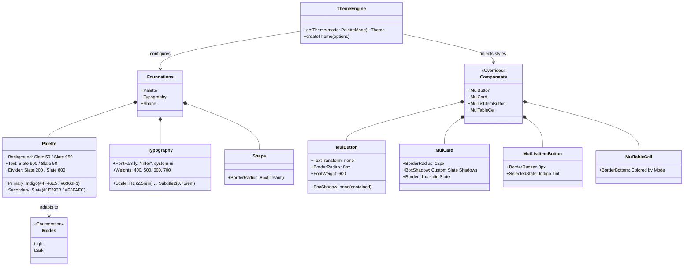

# Design System High-Level Diagram

This diagram represents the high-level architecture of the Design System integrated into the Payroll System. It details the relationship between the core token foundations, component overrides, and the theming engine that supports light and dark modes.

## Key Design Principles

1.  **Premium Aesthetics**: Usage of Inter font, custom shadows, and refined Indigo/Slate palette.
2.  **Glassmorphism**: Applied in key areas (e.g., Login Card) using backdrop-filter and translucency.
3.  **Consistency**: Global overrides ensure all MUI components align with the design system tokens.
4.  **Dark Mode Support**: First-class support with semantic color mapping for backgrounds and text.
