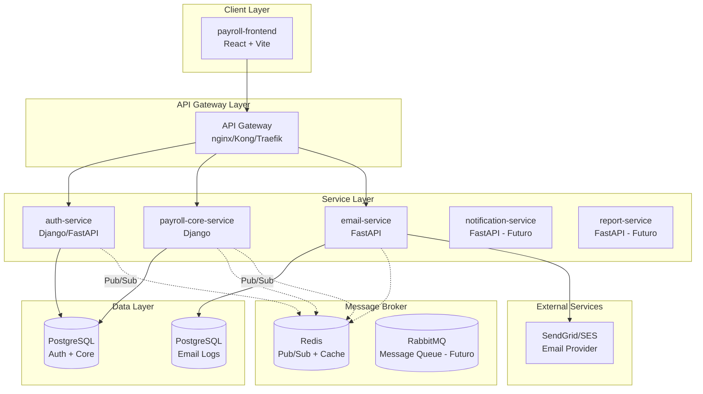

# Arquitetura de Microserviços - Payroll System

## Visão Geral

Este documento define a arquitetura de microserviços para o Payroll System, preparando o sistema para escalabilidade e manutenibilidade de longo prazo.

## Arquitetura Atual vs. Proposta

### Estado Atual (Monolito Modular)

```
┌─────────────────────────────────────┐
│      payroll-frontend (React)       │
└──────────────┬──────────────────────┘
               │ HTTP/REST
┌──────────────▼──────────────────────┐
│      payroll-backend (Django)       │
│  - Autenticação                     │
│  - Multi-tenancy                    │
│  - Payrolls                         │
│  - Providers                        │
│  - Dashboard                        │
└──────────────┬──────────────────────┘
               │
┌──────────────▼──────────────────────┐
│      PostgreSQL Database            │
└─────────────────────────────────────┘
```

### Arquitetura Proposta (Microserviços)



## Serviços Propostos

### 1. **auth-service** (Fase 1 - Futuro)

**Responsabilidades:**

- Autenticação JWT
- Gerenciamento de tokens
- Refresh tokens
- Password reset tokens
- Multi-tenancy tenant resolution

**Stack:**

- Django REST Framework ou FastAPI
- PostgreSQL
- Redis (cache de sessões)

**Endpoints:**

- `POST /auth/login`
- `POST /auth/logout`
- `POST /auth/refresh`
- `POST /auth/password-reset/request`
- `POST /auth/password-reset/confirm`
- `GET /auth/me`

---

### 2. **payroll-core-service** (Atual payroll-backend)

**Responsabilidades:**

- Gestão de payrolls
- Gestão de providers
- Cálculos de folha
- Dashboard e analytics
- Multi-tenancy (companies/customers)

**Stack:**

- Django REST Framework
- PostgreSQL
- Redis (cache)

**Endpoints:**

- `/payrolls/*`
- `/providers/*`
- `/dashboard/*`
- `/companies/*`

---

### 3. **email-service** (Fase 1 - Novo) ⭐

**Responsabilidades:**

- Envio de emails transacionais
- Gestão de templates
- Retry de falhas
- Logs de envio
- Rate limiting

**Stack:**

- **FastAPI** (async, rápido, leve)
- PostgreSQL (logs)
- Redis (fila + cache)
- SendGrid/AWS SES (provedor)

**Endpoints:**

- `POST /email/send` - Envia email individual
- `POST /email/send-bulk` - Envia emails em lote
- `GET /email/templates` - Lista templates
- `GET /email/logs` - Histórico de envios
- `GET /email/status/{id}` - Status de um email

**Eventos consumidos (Redis Pub/Sub):**

- `user.password_reset_requested`
- `payroll.completed`
- `provider.payment_processed`

---

### 4. **notification-service** (Fase 2 - Futuro)

**Responsabilidades:**

- Notificações in-app
- Push notifications
- SMS (Twilio)
- WebSockets para real-time

---

### 5. **report-service** (Fase 3 - Futuro)

**Responsabilidades:**

- Geração de relatórios PDF
- Exportação de dados (Excel, CSV)
- Relatórios customizados

---

## Comunicação Entre Serviços

### Síncrona (HTTP/REST)

- **Frontend → API Gateway → Services**
- **Service → Service** (quando resposta imediata é necessária)

```python
# Exemplo: Core service solicita envio de email
import httpx

async def send_password_reset_email(user_email: str, reset_token: str):
    async with httpx.AsyncClient() as client:
        response = await client.post(
            "http://email-service:8001/email/send",
            json={
                "template": "password_reset",
                "to": user_email,
                "context": {"reset_token": reset_token}
            }
        )
    return response.json()
```

### Assíncrona (Event-Driven via Redis Pub/Sub)

- **Eventos de negócio** que não precisam de resposta imediata
- **Desacoplamento** entre serviços

```python
# Publisher (payroll-core-service)
import redis

r = redis.Redis(host='redis', port=6379)

def request_password_reset(user_email: str, reset_token: str):
    event = {
        "event_type": "user.password_reset_requested",
        "data": {
            "email": user_email,
            "token": reset_token,
            "timestamp": datetime.utcnow().isoformat()
        }
    }
    r.publish("payroll.events", json.dumps(event))

# Subscriber (email-service)
import redis

def subscribe_to_events():
    r = redis.Redis(host='redis', port=6379)
    pubsub = r.pubsub()
    pubsub.subscribe("payroll.events")

    for message in pubsub.listen():
        if message['type'] == 'message':
            event = json.loads(message['data'])
            if event['event_type'] == 'user.password_reset_requested':
                send_password_reset_email(event['data'])
```

---

## API Gateway

### Opções Recomendadas

#### 1. **Nginx** (Simples, recomendado para início)

```nginx
upstream auth_service {
    server auth-service:8000;
}

upstream core_service {
    server payroll-core-service:8000;
}

upstream email_service {
    server email-service:8001;
}

server {
    listen 80;

    location /auth/ {
        proxy_pass http://auth_service/;
    }

    location /api/ {
        proxy_pass http://core_service/;
    }

    location /email/ {
        proxy_pass http://email_service/;
    }
}
```

#### 2. **Kong** (Mais features, médio prazo)

- Rate limiting
- Authentication
- Analytics
- Load balancing

#### 3. **Traefik** (Cloud-native, Docker-friendly)

- Auto-discovery de serviços
- Let's Encrypt automático
- Dashboard integrado

---

## Estrutura de Dados

### Shared Database vs. Database per Service

**Recomendação Híbrida:**

```
┌─────────────────────────────────────┐
│  postgres_auth_core (Compartilhado) │
│  - Companies (Tenants)              │
│  - Users                            │
│  - Payrolls                         │
│  - Providers                        │
└─────────────────────────────────────┘

┌─────────────────────────────────────┐
│  postgres_email (Isolado)           │
│  - email_templates                  │
│  - email_logs                       │
│  - email_queue                      │
└─────────────────────────────────────┘
```

**Justificativa:**

- **Auth + Core compartilhado**: Strong consistency para dados de negócio
- **Email isolado**: Não precisa de transações com core, pode escalar independente

---

## Plano de Migração

### Fase 1 (Agora - 2 semanas)

✅ **email-service** como primeiro microserviço

- Criar estrutura do serviço
- Implementar envio de emails
- Integrar com Redis
- Implementar "Esqueceu a senha"

**Estrutura:**

```
payroll-system/
├── payroll-backend/          # Core existente
├── payroll-frontend/         # Frontend existente
├── payroll-email-service/    # NOVO
│   ├── app/
│   │   ├── main.py
│   │   ├── api/
│   │   ├── services/
│   │   ├── models/
│   │   └── templates/
│   ├── Dockerfile
│   ├── requirements.txt
│   └── .env.example
├── docker-compose.yml        # ATUALIZAR
└── docs/
```

### Fase 2 (1-2 meses)

🔄 **Extrair auth-service** do core

- Mover lógica de autenticação
- Configurar comunicação service-to-service
- Manter compatibilidade

### Fase 3 (3-6 meses)

🚀 **Adicionar serviços auxiliares**

- notification-service
- report-service

---

## Docker Compose Atualizado (Proposta)

```yaml
version: "3.8"

services:
  # Existing services
  frontend:
    build: ./payroll-frontend
    ports:
      - "5173:5173"
    depends_on:
      - api-gateway

  backend:
    build: ./payroll-backend
    environment:
      - REDIS_URL=redis://redis:6379
      - EMAIL_SERVICE_URL=http://email-service:8001
    depends_on:
      - db
      - redis

  # NEW: Email Service
  email-service:
    build: ./payroll-email-service
    environment:
      - REDIS_URL=redis://redis:6379
      - SENDGRID_API_KEY=${SENDGRID_API_KEY}
      - DATABASE_URL=postgresql://postgres:postgres@db_email:5432/email_db
    depends_on:
      - db_email
      - redis
    ports:
      - "8001:8001"

  # NEW: API Gateway (Nginx)
  api-gateway:
    image: nginx:alpine
    volumes:
      - ./nginx/nginx.conf:/etc/nginx/nginx.conf:ro
    ports:
      - "80:80"
    depends_on:
      - backend
      - email-service

  # Existing database
  db:
    image: postgres:15-alpine
    environment:
      - POSTGRES_DB=payroll
      - POSTGRES_USER=postgres
      - POSTGRES_PASSWORD=postgres
    volumes:
      - postgres_data:/var/lib/postgresql/data

  # NEW: Email service database
  db_email:
    image: postgres:15-alpine
    environment:
      - POSTGRES_DB=email_db
      - POSTGRES_USER=postgres
      - POSTGRES_PASSWORD=postgres
    volumes:
      - postgres_email_data:/var/lib/postgresql/data

  # NEW: Redis for caching and pub/sub
  redis:
    image: redis:7-alpine
    ports:
      - "6379:6379"
    volumes:
      - redis_data:/data

volumes:
  postgres_data:
  postgres_email_data:
  redis_data:
```

---

## Considerações Técnicas

### Autenticação Multi-Service

**JWT com shared secret:**

```python
# Todos os serviços validam o mesmo JWT
JWT_SECRET = os.getenv("JWT_SECRET")  # Mesmo em todos os services
JWT_ALGORITHM = "HS256"

# Middleware em cada service
async def verify_jwt(request: Request):
    token = request.headers.get("Authorization", "").replace("Bearer ", "")
    payload = jwt.decode(token, JWT_SECRET, algorithms=[JWT_ALGORITHM])
    return payload
```

### Multi-tenancy

**Tenant ID em todos os requests:**

```python
# Header: X-Tenant-ID ou extraído do token JWT
class TenantMiddleware:
    async def __call__(self, request: Request, call_next):
        tenant_id = request.headers.get("X-Tenant-ID")
        # Inject tenant into request state
        request.state.tenant_id = tenant_id
        return await call_next(request)
```

### Observabilidade

**Logging centralizado:**

- Structured logging (JSON)
- Correlation IDs
- ELK Stack (futuro) ou Loki

**Métricas:**

- Prometheus + Grafana
- Service health endpoints: `GET /health`

---

## Próximos Passos

1. ✅ **Revisar e aprovar esta arquitetura**
2. 🚀 **Implementar email-service** (Fase 1)
3. 🔧 **Configurar Redis e atualizar docker-compose**
4. 📧 **Implementar "Esqueceu a senha"**
5. 📊 **Adicionar monitoramento básico**

---

## Perguntas para Discussão

1. **Email Provider**: Qual prefere? SendGrid, AWS SES, Mailgun?
2. **API Gateway**: Nginx simples ou Kong/Traefik?
3. **Message Broker**: Redis Pub/Sub suficiente ou quer RabbitMQ desde já?
4. **Observabilidade**: Implementar agora ou depois?

---

**Status**: 📋 Proposta para revisão e aprovação
